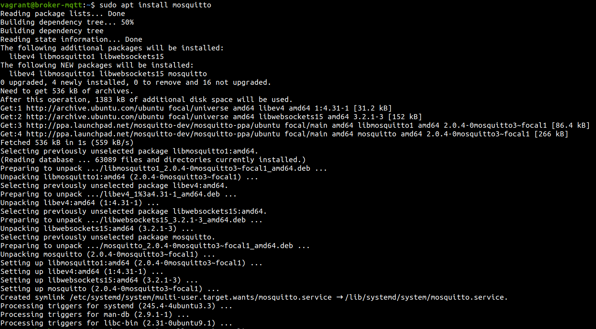
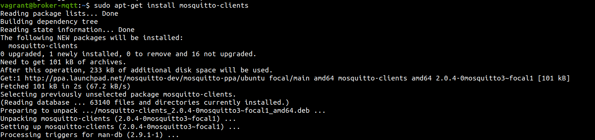
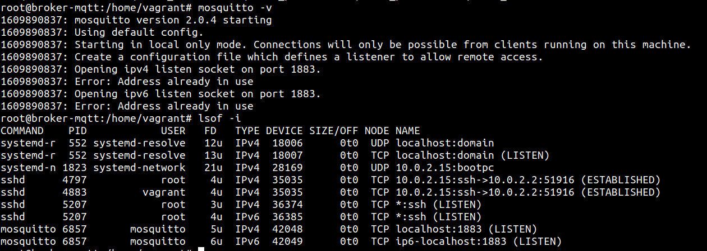
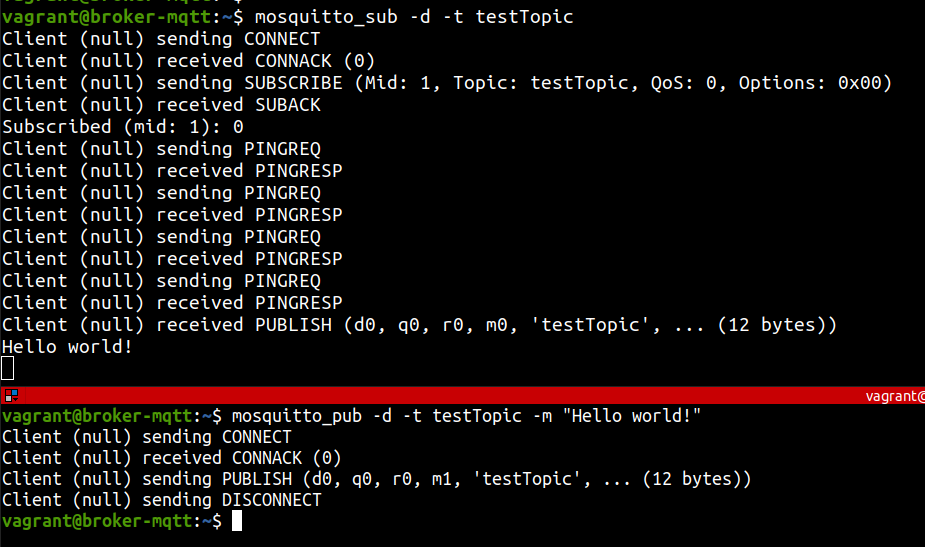
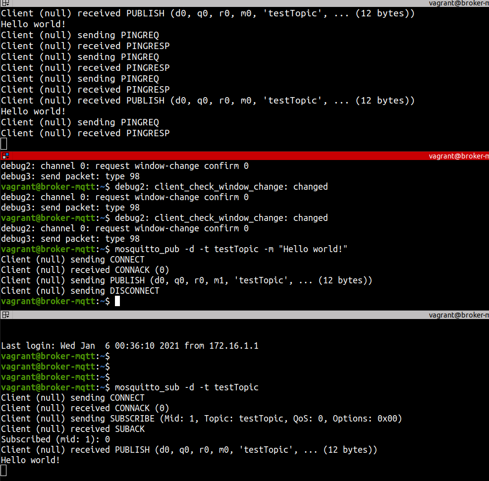

Semana del 4 de Enero de 2021
=============================

## Entorno de prueba

Para levantar las máquinas voy a usar un orquestador de máquinas vrituales, [vagrant](https://www.vagrantup.com/). Este es el archivo de configuración:

```ruby
\<VAGRANTFILE\>
```

El entorno de prueba se compone de los siguientes nodos:

1. Broker MQTT
2. Servidor
3. Cliente

Para el servidor MQTT, voy a usar la herramienta open-source [mosquitto](https://mosquitto.org/). Instalación en Ubuntu:

```
sudo apt-add-repository ppa:mosquitto-dev/mosquitto-ppa
sudo apt-get update
sudo apt install mosquitto
sudo apt install mosquitto-client
```





## Comenzar a publicar mensajes en un tópico

A continuación muestra un ejemplo de prueba donde:

1. Subscribo el broker a un tópico de prueba llamado *testTopic*

2. Publico un mensaje en el tópico recién creado



Si abrimos una tercera terminal, nos subscribimos al mismo tópico y volvemos a mandar el mismo mensaje desde la terminal primera podemos observar que las restantes terminales lo reciben:

