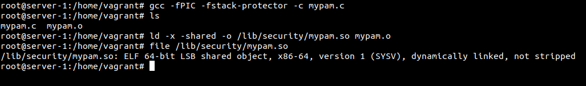

# Semana del 11 de Enero de 2021

## Añadir cliente a un tópico y comprobar que se comunica con el broker

La semana pasada llegué a instalar el broker mqtt en un VM aprovisionada con Vagrant.
Primero instalamos el cliente de `mosquitto` en la máquina cliente:

``console
sudo apt-add-repository ppa:mosquitto-dev/mosquitto-ppa
sudo apt update
sudo apt install mosquitto mosquitto-clients
``


Como se puede apreciar en la imagen, mosquito está configurado en modo local, es decir que solo escucha a sí mismo. No puede subscribirse ni publicar mensajes entre máquinas remotas. Para poder subscribirse 
y publicar mensajes entre máquinas remotas usamos la opción -h:


## Módulo PAM

Cuando se establece la conexión entre el cliente y el servidor por SSH, este servicio usa su
módulo PAM para autenticar al cliente, siempre y cuando este activa la opción (*UsePam yes*) en el
archivo de configuración */etc/ssh/sshd_config*.


De primeras, el módulo PAM que voy a crear simplemente impreme por pantalla si el cliente que
accede al servidor es superusuario o no. Para ello me he ayudado de una plantilla publicada en un 
[repositorio](https://github.com/beatgammit/simple-pam) público en GitHub modificando levemente el 
contenido:

```c
#include <stdio.h>
#include <stdlib.h>
#include <string.h>
#include <security/pam_appl.h>
#include <security/pam_modules.h>

PAM_EXTERN int pam_sm_authenticate( pam_handle_t *pamh, int flags,int argc, const char **argv ) {
	int retval;

	const char* pUsername;
	retval = pam_get_user(pamh, &pUsername, "Username: ");

	if (strcmp(pUsername, "root") != 0) {
		printf("Non root auth\n");
	} else {
		printf("Root auth\n");
	}
	
	return PAM_SUCCESS;
}
```

Para crear un módulo PAM, es necesario dos pasos:

1. Compilarlo el programa en C aplicando medidas de protección de pila creando un archivo objeto

``gcc -fPIC -fstack-protector -c /ruta/archivo.c``

Con la opción *fPIC* (*Position Independent Code*) evitamos sea susceptible a vulnerabilidades como
el desbordamiento de pila ya que al cargarse en esta, la posición es completamente aleatoria.
La opción *fstack-protector* habilita la protección generando código extra en lo que la comprobación
de desbordamiento de pila se refiere.

Es posible que al compilar, salga el siguiente error:


Esto indica que la librería de C para desarrollar aplicaciones con PAM (*libpam*) no está instalada.
Primero comprobamos el nombre de esta librería buscando en la base de datos de APT (*Advanced 
Packaging Tool*) la librería PAM de desarrollo:


De todas las listadas, la primera (*libpam0g-dev*) es la que nos interesa. La instalamos en nuestro 
servidor con el siguiente comando:+

``sudo apt install libpam0g-dev --fix-broken`` 

Con la opción *fix-broken* le indicamos a APT que si hay dependencias rotas, las corriga 
automáticamente.


2. Enlazar el archivo objeto creando un archivo de biblioteca compilado (.so o *Shared Object*) en la 
ruta por defecto donde se almacenan los módulos PAM

``sudo ld -x -shared -o /lib/security/archivo.so /ruta/archivo.c``

Con la opción *shared* indicamos al enlazador que el archivo de biblioteca que se va a crear es 
compartido
La opción *x* borra todos los símbolos locales
Y con la opción *o* referenciamos el arhivo de salida. La ruta */lib/security* es una de las rutas 
donde se guardan los módulos PAM por defecto.

En el servidor, escribimos nuestro archivo en C, lo compilamos y lo enlazamos:



## Configuración del módulo PAM para el servicio SSH

Una vez compilado y enlazado el módulo PAM, hay que indicarle a ssh que lo use cuando un cliente
intenta acceder al servidor. Para ello modificamos el archivo */etc/pam.d/sshd* forzando a ssh
a que use al principio este módulo:

```
# PAM configuration for the Secure Shell service

# My personal PAM module (mypam)
# Prints "Root auth" or "Non root auth" depending if the user who try to
# access is root or not
auth       required     mypam.so 

# Standard Un*x authentication.
@include common-auth

# Disallow non-root logins when /etc/nologin exists.
account    required     pam_nologin.so

# Uncomment and edit /etc/security/access.conf if you need to set complex
# access limits that are hard to express in sshd_config.
# account  required     pam_access.so

# Standard Un*x authorization.
@include common-account

# SELinux needs to be the first session rule.  This ensures that any
# lingering context has been cleared.  Without this it is possible that a
# module could execute code in the wrong domain.
session [success=ok ignore=ignore module_unknown=ignore default=bad]        pam_selinux.so close

# Set the loginuid process attribute.
session    required     pam_loginuid.so

# Create a new session keyring.
session    optional     pam_keyinit.so force revoke

# Standard Un*x session setup and teardown.
@include common-session

# Print the message of the day upon successful login.
# This includes a dynamically generated part from /run/motd.dynamic
# and a static (admin-editable) part from /etc/motd.
session    optional     pam_motd.so  motd=/run/motd.dynamic
session    optional     pam_motd.so noupdate

# Print the status of the user's mailbox upon successful login.
session    optional     pam_mail.so standard noenv # [1]

# Set up user limits from /etc/security/limits.conf.
session    required     pam_limits.so

# Read environment variables from /etc/environment and
# /etc/security/pam_env.conf.
session    required     pam_env.so # [1]
# In Debian 4.0 (etch), locale-related environment variables were moved to
# /etc/default/locale, so read that as well.
session    required     pam_env.so user_readenv=1 envfile=/etc/default/locale

# SELinux needs to intervene at login time to ensure that the process starts
# in the proper default security context.  Only sessions which are intended
# to run in the user's context should be run after this.
session [success=ok ignore=ignore module_unknown=ignore default=bad]        pam_selinux.so open

# Standard Un*x password updating.
@include common-password
```

Comprobamos que funciona accediendo por ssh al servidor:


## Comunicación servidor con broker mqtt

Por ahora, se conecta por ssh al servidor, el módulo PAM de ssh imprime si 
se conecta como superusuario o no. Una vez conectado, el servidor necesita
verificar que el cliente tiene los permisos necesarios para acceder. Para 
ello, una vez el módulo PAM garantiza su acceso, el servidor crea un hash con 
la función criptográfica SHA-256 de la unión de dos cadenas:

1. Desafio: string aleatorio
2. Palabra secreta: string que un cliente legítimo posee

### Hash SHA-256

Para esta parte, he creado un simple script que hace lo siguiente:

1. Crea una cadena aleatoria o desafío
2. Crea un archivo temporal con las el desafío y la palabra secreta
3. Calcula el hash con SHA-256 
4. Envía el desafio 

```shell
# Script which calculates SHA256 hash of:
# - Challenge (random string of 64 bytes)
# - Secret word (key between server and trusted client)

SECREAT_WORD_FILE_PATH=/root/secret-word.txt

echo 'Creating challenge string...'
CHALLENGE=`tr -dc A-Za-z0-9 < /dev/urandom | head -c 64; echo ''`
echo "CHALLENGE=$CHALLENGE"

echo 'Creating a tmp file with challenge + secret word...'
TMPFILE=$(mktemp /tmp/abc-script.XXXXXX)
echo $CHALLENGE >> $TMPFILE
cat $SECREAT_WORD_FILE_PATH >> $TMPFILE
echo "TMPFILE=$TMPFILE"

echo 'Calculating SHA256 hash of challenge + secret word...'
SHA256=`sha256sum $TMPFILE | awk '{print $1}'`
echo "SHA256=$SHA256"

echo 'Sending challenge to MQTT Broker...'
```